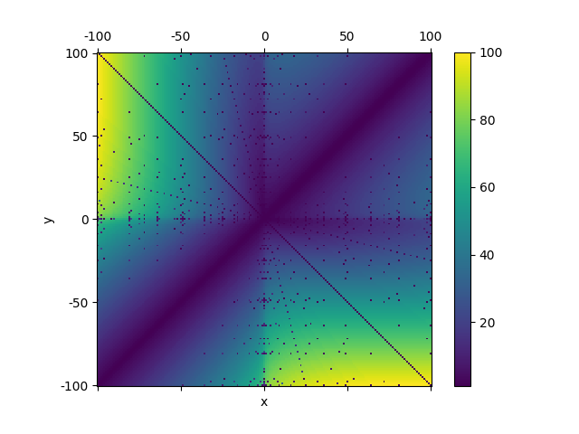

+++
title = "将浮点数转换为某些特定数学表达式的高效算法"
date = 2024-08-21T10:07:08+08:00
dropCap = false
summary = "在本文中，我将介绍一个新的算法将某些特定的浮点数转换为形如sqrt(a)±sqrt(b)的数学表达式。首先，我将从理论角度分析该算法的可行性；其次，我会将理论转换成实际算法；最后，我会将该算法与其它算法进行比较，并分析各自的优劣。"
tags = ["数学", "计算机科学"]
katex = true
+++

## 引言
一些数值计算器在计算分式、根式以及角度时会返回类似$\dfrac{2\sqrt{2}}{3}$或$\dfrac{\pi}{3}$的结果而非浮点数。它们同样也会显示$1+\sqrt{2}$和$\dfrac{\sqrt{2}+\sqrt{3}}{2}$。前两者可通过简单的数学运算得出，但是后面两个涉及到了加法运算。如果我们想分别求出$\sqrt{a}+\sqrt{b}$中的$a$和$b$，最简单的方法是使用二重`for`循环，但这是效率非常低的方法。我们是否可以设计一种高效的方法解决上述问题？

在本文中，我将介绍一个新的算法将某些特定的浮点数转换为形如$\sqrt{a}\pm\sqrt{b}$的数学表达式。首先，我将从理论角度分析该算法的可行性；其次，我会将理论转换成实际算法；最后，我会将该算法与其它算法进行比较，并分析各自的优劣。

## 理论
我们先讨论没有分母的形式。为叙述方便，先定义一函数
$$S(x,y)=\mathrm{sgn}(x)\sqrt{|x|}+\mathrm{sgn}(y)\sqrt{|y|}\quad \text{其中}x,y\in\mathbb{Z}$$
在本文中，我们已知浮点数$n$与$S(a,b)$近似相等（即两数之差小到可以忽略），但$a$、$b$未知。我们的目的是求出特定的$a$和$b$使$|S(a,b)-n|\leq\varepsilon$，其中$\varepsilon$是一个很小的数。换句话来说，我们希望找到$S(x,y)$的反函数$P(x)$。

当然，使用既定公式求出$P(x)$是不可能的。唯一可行的途径是穷举搜索。使用不同的方法进行穷举都可以获得正确的结果，但效率的差异可能是巨大的。在下文中，我将介绍一种效率较高的方法。

假如我们知道两数之和$p+q$，以及他们的均值$m=\dfrac{p+q}{2}$，那么可以知道$|m-p|=|m-q|$。

同样的，如果已知$n=S(a,b)$, 我们可以从$\dfrac{n}{2}$开始向$\pm\infty$方向分别搜索。一旦确定了$a$就可以知道唯一的$b$，最后我们仅仅需要一些额外的判断就能得知它们是否为所求。

当然，使用$\dfrac{n}{2}$作为初始值是不合适的，因为我们需要的结果是两个整数。使用截尾取整后的$\left(\dfrac{n}{2}\right)^2$更适合。

不过，我们可以计算出$\left(\dfrac{\sqrt{100}+\sqrt{101}}{2}\right)^2\approx100.499$，它会舍入到100，这样的设计也是有漏洞的。但是，有如下极限
$$\lim_{x\to+\infty}\left(\frac{\sqrt{x}+\sqrt{x+1}}{2}\right)^2-x=\frac{1}{2}$$
它表示函数$f(x)=\left(\dfrac{\sqrt{x}+\sqrt{x+1}}{2}\right)^2$可以近似成$x+\dfrac{1}{2}$。

这样，即使$S(a,b)$中的$a$、$b$的差值很小我们也能分别求出它们。

根据以上的分析，我们可以这样计算初始值
$$
    start(n)=
    \begin{cases}
        \lfloor(\frac{n}{2})^2\rfloor+\frac{1}{2}  &n>0 \\\\
        -\lfloor(\frac{n}{2})^2\rfloor-\frac{1}{2} &n<0
    \end{cases}
$$

为了书写方便，下面规定一负数的平方根是其绝对值平方根的相反数。

已知$n=S(a,b)$，初始值$\mathrm{start}=start(n)$，令$\mathrm{step}=0.5$并找到第一个数字
$$p=\mathrm{start}-\mathrm{step}$$
接着就能求出第二个数字
$$q=\frac{n}{2}-|\sqrt{p}-\frac{n}{2}|$$
$q$必须是一个整数，我们接下来还要做如下操作
$$q=\mathrm{sgn}(q)\sqrt{\mathrm{round}(q^2)}$$
其中$\mathrm{round}$表示舍入到最近的整数。

如果$|\sqrt{p}+\sqrt{q}-n|\leq\varepsilon$，其中$\varepsilon$表示一个很小的数，那么$p$和$q$就是所求的$a$和$b$。否则我们令$\mathrm{step}=\mathrm{step}+1$，继续向正无穷方向搜索。

## 实现
以下是本算法的Python实现：
```python
import math

def num2sqrts(n, max_num=1000):
    if n >= 0:
        mid = math.floor((n / 2) ** 2) + 0.5
    else:
        mid = math.ceil(-(n / 2) ** 2) - 0.5
    fsqrt = lambda n: math.copysign(math.sqrt(math.fabs(n)), n)
    actual_mid = n / 2
    t = 0.5
    while True:
        a = fsqrt(mid + t)
        d = math.fabs(a - actual_mid)
        b = actual_mid - d
        b = fsqrt(math.copysign(round(b ** 2), b))
        # 理论上来说，该算法可以一直执行，直到找到正确的结果。
        # 但是考虑到实际情况，我们必须有一个停止条件：
        if abs(a ** 2) > max_num or abs(b ** 2) > max_num:
            return
        if math.isclose(a + b, n, rel_tol=1e-12):
            return int(round(math.copysign(a ** 2, a))), \
                int(round(math.copysign(b ** 2, b)))
        t += 1
```

最后，函数`num2sqrts`以长度为2的元组作为结果；若返回`None`，这表示程序没有找到正确的结果。

如果没有找到结果，那么可以猜测原浮点数是一个形如$\dfrac{\sqrt{a}+\sqrt{b}}{c}$的分数，我们可以通过穷举分母来解决。

为了展示算法的表现，我令$x\in[-100,100]$和$y\in[-100,100]$，接着记录算法需要多少次循环可求出$S(x,y)$中的$x$和$y$，最后把它们以不同的颜色标识（见下图）。可见，当$x$、$y$之差越大时，需要执行更多次的循环。



不过当我们运行如下（或类似）语句时
```python
num2sqrts(2 * math.sqrt(123))
```
函数返回`(492, 0)`，循环执行了438次。不过$2\sqrt{123}$这个结果可以用一个更简单的算法找到，故我将上图中一、三象限对角线上的值全部赋值为1。

## 比较
使用嵌套的`for`循环（我称其为`normal_one`算法）同样也可以求出两根式之和。让两种算法分别求出$\sqrt{a}+\sqrt{b}$，其中$a$和$b$从0到100的整数中随机选取，并各运行5000遍先记录下运行总时间，再计算出运行一次的平均时间（见下表）。可见，`num2sqrts`比纯粹的穷举快了约60倍，而且随着范围的扩大，效率可能会进一步地提高。

| 算法 | 总时间/$s$ | 平均时间/$\mu s$ | 用时之比 |
| :-----------:| :-------: | :-------: | :--: |
| `normal_one` | 18.594490 | 3718.8979 | 60.7 |
| `num2sqrts`  | 0.306463  | 61.2926   | 1.0  |

使用`PSLQ`等整数关系探测算法可以找到一个系数是整数的多项式方程，它的根正好等于一个已知浮点数。

例如可以找到$1+\sqrt{2}$是$x^2-2x-1=0$的一根，那么可以通过构造一元二次方程的求根公式来得出$1+\sqrt{2}$。

对于更一般的情况，即两个根式的和或差，它们是四次方程的根。例如$\sqrt{2}+\sqrt{3}$是$x^4-10x^2+1=0$的一根（虽然它也是$x^2-2\sqrt{2}x-1=0$的一个根，但是这个方程的系数不全是整数，当前的算法并不适用），不过构造一元四次方程的求根公式异常麻烦，故这种方法不能适用所有场合。

同时，这些整数关系探测算法也可以将浮点数转换为更复杂的数学表达式，例如`mpmath`的`mpmath.identify`函数：
```python
>>> import mpmath, sympy
>>> s = mpmath.identify(mpmath.sqrt(2) + mpmath.sqrt(3))
>>> s
'sqrt(((10+sqrt(96))/2))'
>>> sympy.simplify(s)
sqrt(2*sqrt(6) + 5)
```
但是，参照上述的运行结果，问题则变成了化简双重根号，就需要编写化简双重根号的程序了，这里就不涉及了。
