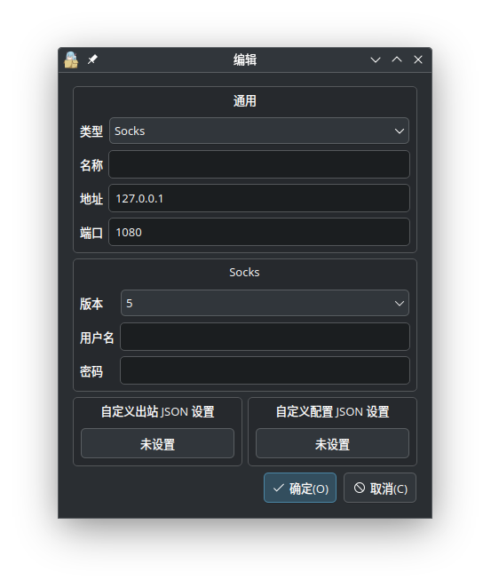

+++
title = "EasierConnect——EasyConnect的开源替代"
date = 2024-08-30T16:42:08+08:00
tags = ["Linux", "EasyConnect"]
+++

上过大学的人都知道：校园网的很多功能必须开启VPN才能使用。很多学校选择一款叫EasyConnect的软件来提供VPN连接，但它对Linux用户[极其不友好](https://www.wannaexpresso.com/2020/06/07/easy-connect-manjaro/)。在这篇博客中，我将介绍其开源替代的编译步骤和使用方法。

<!--more-->

## 下载EasierConnect
[EasierConnect的源代码](https://github.com/lyc8503/EasierConnect)托管在GitHub上，可自行下载或`git clone`。不过该仓库已被标记为“archived”并撤回了开源许可证（作者不更新了）。

> 我尝试了之后发现这个并不能登陆上海电力大学的校园网，但是[TeamSUEP的Fork](https://github.com/TeamSUEP/EasierConnect)却可以。

## 编译EasierConnect
拿到源代码的下一步就是将其编译成可执行文件了。不过EasierConnect需要较老版本的Go1.19.13来编译（打开[下载页面](https://go.dev/dl/)并点击页面较下方的“Archived versions”）。

只需要运行下面一行命令就可以了：
```bash
# 需要科学上网
# 这个 go 必须是老版本的 go，建议使用绝对路径
go build
```

这样源代码目录下就会有一个名叫`EasierConnect`或`EasierConnect.exe`的可执行文件了。

## 使用EasierConnect
现在我们打开终端，输入（以Linux终端为例）：
```bash
./EasierConnect -server <EasyConnect的服务器地址> \
                -username <用户名> \
                -password <密码>
```

当然这样并不能连接到校园网，这只相当于打开了一个代理服务器，我们需要连接这个服务器才可以。

以[NekoBox](https://github.com/MatsuriDayo/nekoray)（也有[Android版](https://github.com/MatsuriDayo/NekoBoxForAndroid)）为例，我们需要设置类型为`Socks5`、端口保持默认、用户名和密码留空、随便起一个名称，如下图所示。



点击“确定”保存并打开这个代理，我们便可以访问校园网了（需要先启动EasierConnect哦）。
