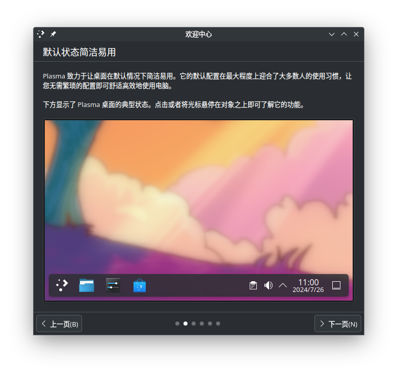

+++
title = "摘下“赛博文盲”这顶帽子"
date = 2024-07-24T20:33:11+08:00
tags = ["闲话"]
katex = true
+++

现在网络上关于那些不会用电脑的年轻人的讨论越来越多了。同为年轻人，我不忍心看到这一现象，想要帮助那些“赛博文盲”，便写下了这篇博客。

<!--more-->

本人坐标上海，这种“赛博文盲”我见到的比较少。毕竟我们上海人接受的教育还是很好的：小学信息课我记不清楚了，但打字、使用浏览器什么的还是教过；初中信息课会教你计算机基础知识和办公软件的使用；高中信息课会教你计算机基础知识的进阶篇和用Python编写程序。

但在高中我碰巧遇到了这样一位“赛博文盲”同学。据他自己所述，他不会在电脑上打字，初中和高中的电脑小报都是找关系好的女生帮忙完成的。我在感慨他异性缘很好的时候也在心里默默为他担心：到大学写论文可就必须用电脑了，如果到了那时候没有人帮你会怎么办呢？
> 这里插一句题外话，我就可以使用安卓手机写论文，但要下载一个叫Termux的终端模拟器，并在里面再安装一个TeX Live，这样就可以用$\LaTeX$写论文了。相比之下，还是电脑上的文字处理器简单，对吧！

现在的“赛博文盲”和我的这位高中同学很像：在20世纪末尾和21世纪出生的、享受着互联网之便利的年轻人，竟然只会使用手机，而不会使用电脑这个比手机更重要的工具。

所以，我想向他们提出两个小建议，来帮助他们摘下“赛博文盲”这顶帽子。

## 向他人求助时端正自己的态度
我注意到“赛博文盲”这个热点是在B站上时不时看到某人骂文件解压缩还要花钱的评论。像这种自己什么都不会做只会埋怨别人做的不能满足自己要求的人最讨厌了，看到这种人点一个“举报”按钮是完全可以的。

不过，如果你真的是一个电脑小白，有不懂的地方想要请教别人，请有礼貌地发言（以下文字由大语言模型生成，纯属虚构）：*您好，我刚刚购买了一台电脑，并且安装了Windows操作系统。我发现我的电脑会自动进行系统升级。我想关闭这个功能，但是一直找不到具体的操作方法。请问您能指导一下我如何操作吗？*

如果你认为他人做得不够好，可以提出自己的意见，但也请肯定他人的劳动成果（以下文字由大语言模型生成，纯属虚构）：*尊敬的作者，您好。非常感谢您为FFmpeg提供的GUI工具，它极大地简化了复杂的操作流程。然而，在使用过程中，我发现操作逻辑仍然存在一定程度的复杂性，同时配色方案过于花哨，这在一定程度上影响了我的操作效率和理解速度。考虑到用户体验和工作效率，我认为可能有必要改进以上问题。*

除了发言的态度，提问的方式和内容也同样重要。这里建议各位阅读[《提问的智慧》](https://github.com/ryanhanwu/how-to-ask-questions-the-smart-way/blob/main/readme-zh_cn.md)这篇文章。

我们中华民族传承了千年的文化中，最重要的核心不正是“礼”吗？“礼”不仅仅是应试教育的一环，更是我们日常生活中及其重要的一部分——以礼待人。在过去的封建社会是这样的，在现代的信息化社会更应该如此。同时，“礼”也是全世界通用的准则，是超越文化的存在。如果你礼貌地提出问题，自然会有人想尽一切办法来为你解答。

在这个国骂已经变成口头禅的社会，希望我们在能够编辑自己发言的时候去除那些不友好的文字。我们向他人求助时端正自己的态度，他人定会热情地帮助我们。

> 上面这些话只是我的美好想象，我认为某些国人就是没有礼貌、不懂规矩，已经没救了！我想这可能主要是大环境（中国社会）存在着严重的问题。

## 自己动手做最重要
我同时也注意到有人把握商机，把Steam代安装服务放在购物网站上出售了。这里不讨论那些打算卖服务赚钱的人有什么想法。我们来看看为什么有些人宁愿花钱安装一个原本就可以免费下载的软件，而不是坐下来好好学习《初学者的计算机使用指南》（随便编的一个书名）。

当然，肯定没有什么所谓的《初学者的计算机使用指南》。例如我写这篇博客时正在使用的KDE Plasma桌面环境，第一次运行的时候会显示一个“欢迎中心”，介绍了桌面上的各个部件及用途。

虽然大部分软件不会在第一次启动时教你如何使用，但是它们大多数也会有明确的指引（例如浏览器的地址栏上有“搜索或输入网址”的提示）和帮助（将光标悬停在按钮或者菜单选项上）。这不正是一本教你如何使用电脑和软件的《初学者的计算机使用指南》吗？

不知道大家是如何学会操作电脑和手机的图形用户界面的？你可能在一瞬间会有那么些迷茫，因为并没有什么东西教我们如何操作GUI，而是我们摸索着通过使用鼠标、键盘和触摸屏来和软件互动以完成对应的操作。久而久之，便通过试错写就了自己的一本《计算机使用指南》或是《移动设备使用指南》。
