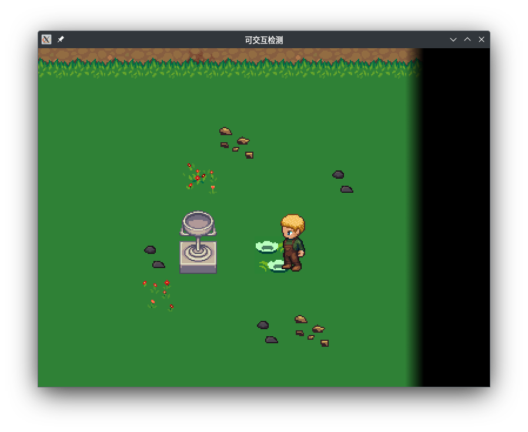
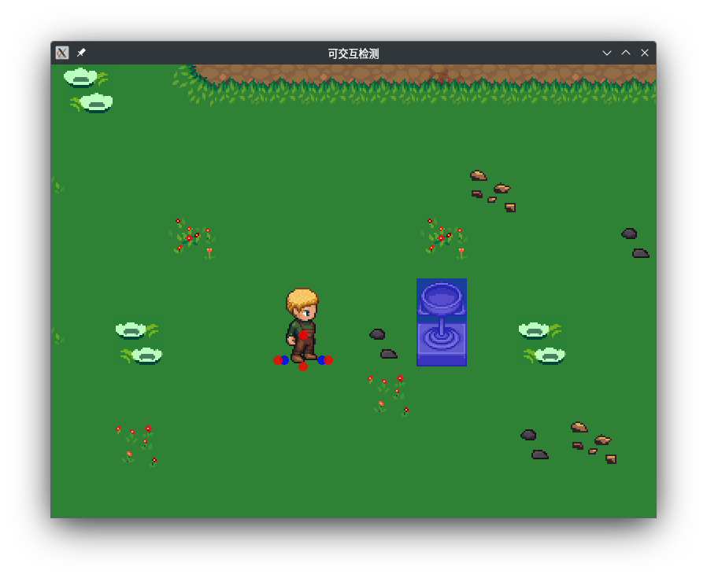

+++
title = "二维 RPG 游戏中简单的可交互检测"
date = 2024-04-06T21:15:03Z
categories = ["编程"]
tags = ["游戏开发"]
+++

在2D游戏中角色可以随意的移动，不过它们可是不能随便“踩过”一个可交互的物体（比如说一扇门）。在这种碰撞箱不会相交的情况下，程序要如何判断角色是否可以和物体交互呢？在这篇博客中，我将介绍一种比较简单的方法来处理上述问题。不需要游戏引擎！（本篇仍在写作中）

<!--more-->

像上图一样，玩家看到了一个奖杯，想要看看它能触发什么剧情。于是就会操纵角色走近奖杯，面朝着它点击“空格”键。

做这样一套动作是非常自然的，程序也应该在玩家按下“空格”键之后进行判断：若角色可以和奖杯交互，则调用一个函数；否则就不做任何事。

那么程序应该怎样判断呢？我想，玩家的动作中有两点非常重要：

1. 走近物体：角色必须离物体足够近
2. 面朝物体：角色的视线必须和物体的碰撞箱相交

如果程序能够正确判断这两点，那么理论上玩家便能和他想要的物体交互。

